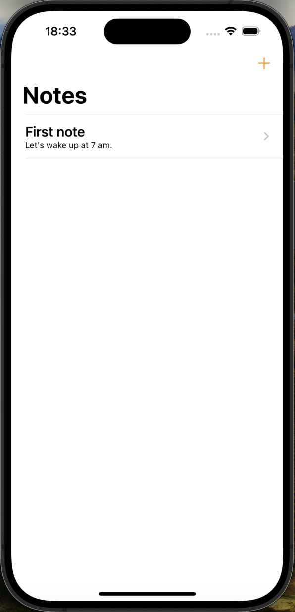
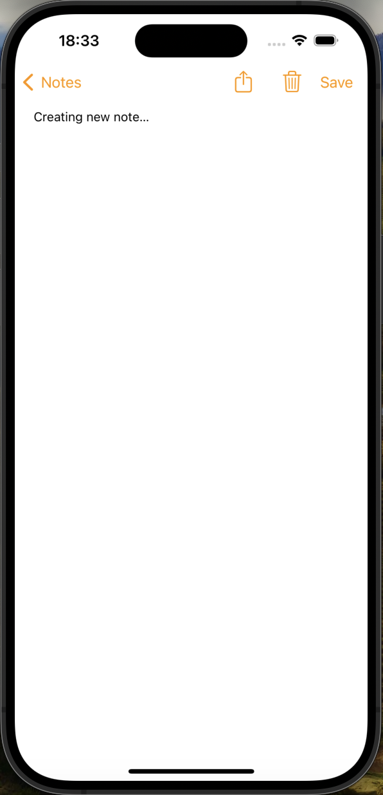
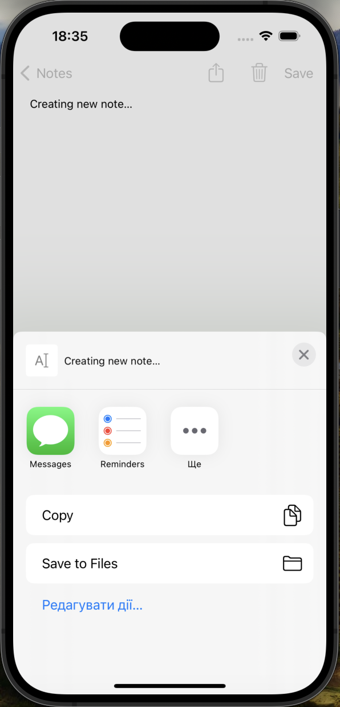

# NotesProject

NotesProject is a simple note-taking application built using Swift and UIKit. It allows users to create, edit, delete, and share notes. The application persists notes data using a JSON file stored in the app's document directory.

## Features

- Create new notes
- Edit existing notes
- Delete notes
- Share notes via other applications
- Automatically save and load notes from a JSON file
- Responsive keyboard adjustment

## Usage

1. Launch the application to see a list of notes.
2. Tap the "+" button to create a new note.
3. Enter your note content and save it by tapping the "Save" button.
4. To edit or delete a note, tap on it from the list and use the "Save" or "Delete" button.
5. Share a note by tapping the "Share" button.

## Screenshots

### Main Screen

### Create Note

### Note Share

## Possible Improvements

- Add search functionality to quickly find notes.
- Implement note categorization and tagging.
- Enhance the UI with custom themes and fonts.
- Support multimedia notes with images and audio recordings.
- Implement cloud synchronization for notes backup and sharing across devices.
